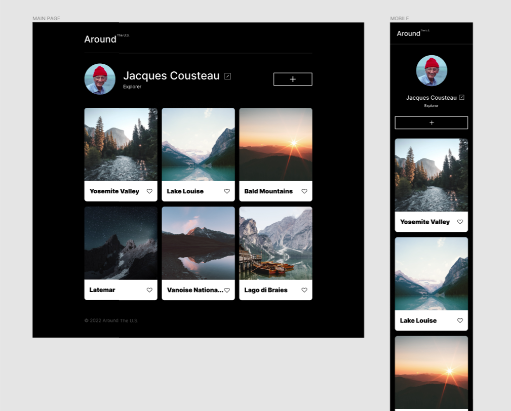

# Practicum Project 3: Around The U.S.

This project is uses media queries, grid layout, and is based on a Figma design brief provided. This project is made so all the elements are displayed correctly on popular screen sizes.

### Project Features

- Grid Layout
- Figma
- Media Queries

**Figma**

- [Link to the project on Figma](https://www.figma.com/file/ii4xxsJ0ghevUOcssTlHZv/Sprint-3%3A-Around-the-US?node-id=0%3A1)

**Images**

**URL**

Site is live at https://andkirsten.github.io/se_project_aroundtheus/
